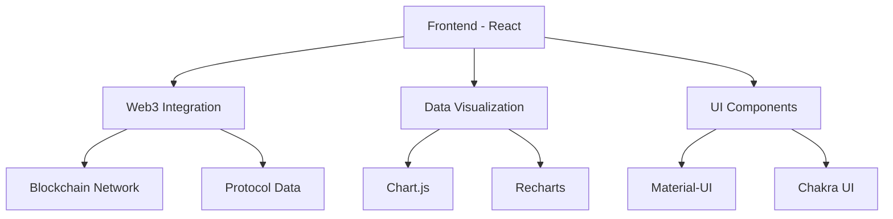
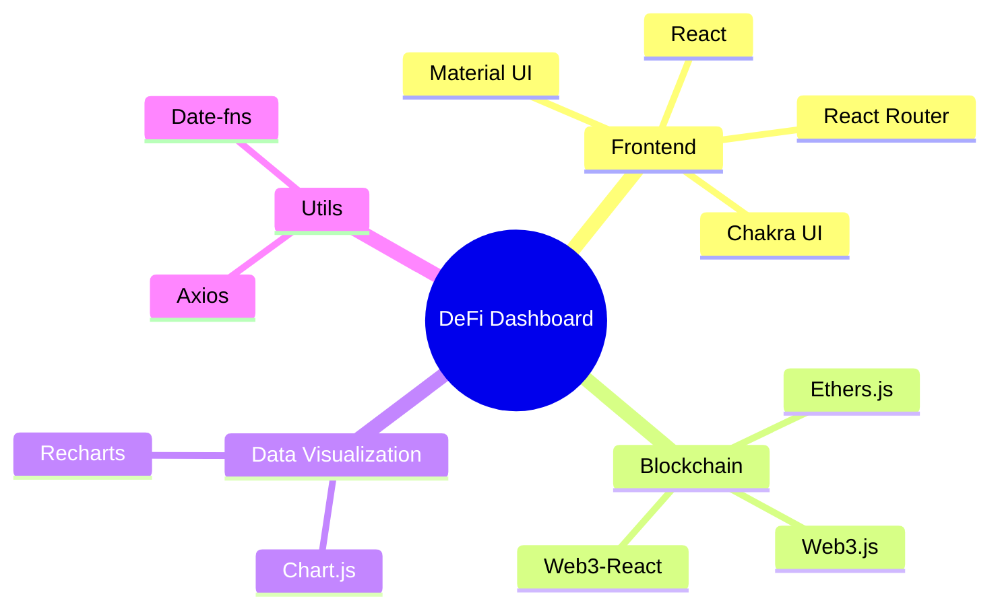
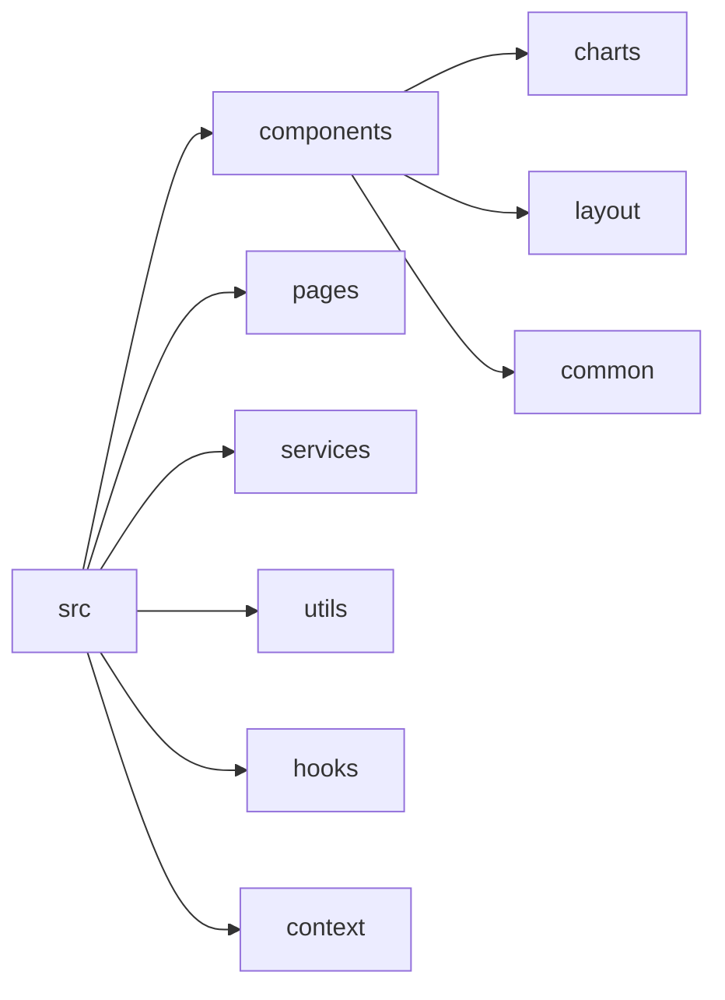

# DeFi Analytics Dashboard

A comprehensive dashboard for analyzing and visualizing DeFi (Decentralized Finance) metrics and data using React, Web3, and various data visualization libraries.

## Features

- Real-time DeFi protocol analytics
- Interactive charts and graphs using Chart.js and Recharts
- Web3 wallet integration
- Responsive Material-UI design
- Multi-protocol support
- Historical data analysis

## Architecture



## Tech Stack



## Getting Started

### Prerequisites

- Node.js (v14 or higher)
- npm or yarn
- MetaMask or any Web3 wallet

### Installation

1. Clone the repository
```bash
git clone https://github.com/yourusername/defi-analytics-dashboard.git
cd defi-analytics-dashboard
```

2. Install dependencies
```bash
npm install
```

3. Start the development server
```bash
npm start
```

The application will be available at `http://localhost:3000`

## Project Structure



## Available Scripts

- `npm start`: Run development server
- `npm build`: Build for production
- `npm test`: Run tests
- `npm run eject`: Eject from Create React App

## Contributing

1. Fork the repository
2. Create your feature branch (`git checkout -b feature/AmazingFeature`)
3. Commit your changes (`git commit -m 'Add some AmazingFeature'`)
4. Push to the branch (`git push origin feature/AmazingFeature`)
5. Open a Pull Request

## License

This project is licensed under the MIT License - see the LICENSE file for details.

## Acknowledgments

- [Create React App](https://github.com/facebook/create-react-app)
- [Material-UI](https://mui.com/)
- [Web3.js](https://web3js.readthedocs.io/)
- [Chart.js](https://www.chartjs.org/)
